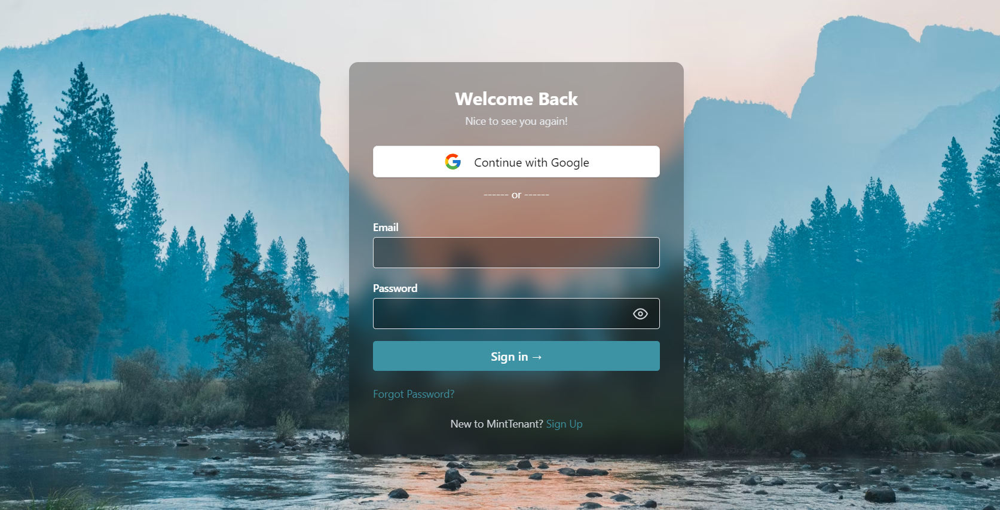
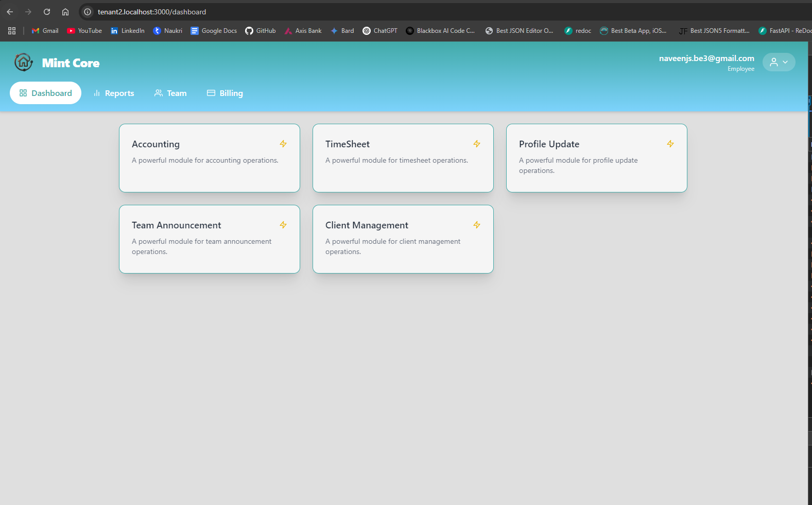

# 🌟 Mint Tenant Core – Multi-Tenant Frontend

Mint Tenant Core is a **multi-tenant React application** built to support customizable, isolated tenant experiences for HR, billing, team management, and more. Each tenant can have unique branding, users, and access levels — all powered by Firebase and a unified component-driven UI.

---

## 📌 Overview

- 🔐 Firebase Authentication (Email/Password + Google)
- 🧑‍💼 Role-based access control (Admin, HR, Employee)
- 🏢 Subdomain-based multi-tenant separation
- 🎨 Dynamic theming and branding (per tenant)
- 📂 Feature flag configuration per tenant
- ⚛️ Built with React, React Router, Firebase SDK, and Tailwind CSS
- 🧪 Unit tested with Jest & React Testing Library

---

## 🔗 Live Demo

> ⚠️ URL 1:
**[🔗 https://mint-tenant-core](https://tenant1-multitenantcore.web.app/login)**

> ⚠️ URL 2:
**[🔗 https://mint-tenant-core](https://tenant2-multitenantcore.web.app/login)**

---

## 🖼️ Screenshots

| Login Screen              | Dashboard 1                 | Dashboard 2                 |
|---------------------------|-----------------------------|-----------------------------|
|  |  |  |

---

## 🏗️ Folder Structure

```bash
  src/
    ├── assets/                    # Logos, images, animations (e.g., Lottie)
    ├── component/
    │   ├── api.js                 # Axios instance with tenant-aware routing
    │   ├── firebase.js           # Firebase config & initialization
    │   ├── LoginPage.js          # Login form with toast and auth
    │   ├── DashboardOne.js       # First tenant's dashboard (Admin view)
    │   ├── DashboardTwo.js       # Alternate tenant dashboard (HR or user view)
    │   ├── DashboardRouter.js    # Dynamically loads correct dashboard by role/tenant
    ├── __tests__/                 # Unit tests for each major component
    ├── App.js                     # Main router and route handling
    ├── index.js                   # App entry point
    └── setupTests.js              # Jest setup with React Testing Library
```

---

## ⚙️ Environment Setup

Create a `.env` file at the root of the frontend with your Firebase credentials and custom settings:

```env
REACT_APP_FIREBASE_API_KEY=AIza...
REACT_APP_FIREBASE_AUTH_DOMAIN=multitenantcore.firebaseapp.com
REACT_APP_FIREBASE_PROJECT_ID=multitenantcore
REACT_APP_FIREBASE_STORAGE_BUCKET=multitenantcore.appspot.com
REACT_APP_FIREBASE_MESSAGING_SENDER_ID=123456789
REACT_APP_FIREBASE_APP_ID=1:123456789:web:abc123def456
REACT_APP_BRAND_COLOR=#6B46C1
REACT_APP_TENANTS=tenant1,tenant2
REACT_APP_AUTH_BG_IMAGE=https://cdn.example.com/assets/auth-bg.jpg
```

> You can find these values in your Firebase Console under **Project Settings > General**.

---

## 🚀 Getting Started

1. **Install dependencies:**

```bash
   npm install
```

2. **Run the development server:**

```bash
   npm start
```

The app will open at `http://localhost:3000`.

3. **Login Flow:**

- Email/Password via Firebase Auth
- Google OAuth via Firebase
- Role & tenant info fetched from Firestore after login

---

## 🧪 Running Tests

Run unit tests:

```bash
   npm test
```

> Tests are written using **Jest** and **React Testing Library**.
>  
> Make sure to mock Firebase and Axios calls where necessary.

---

## 🛠️ Technologies Used

| Tech              | Usage                                |
|-------------------|---------------------------------------|
| React             | UI framework                          |
| React Router      | Client-side routing                   |
| Firebase Auth     | Authentication                        |
| Firestore         | User metadata (roles, tenant info)    |
| Axios             | API communication                     |
| Tailwind CSS      | Utility-first CSS styling             |
| Jest              | Unit testing                          |
| React Testing Lib | Component testing                     |
| React Hot Toast   | User feedback/toasts                  |
| Lottie            | Animations for UX enhancement         |

---

## 💡 Future Improvements (Roadmap)

| Feature                     | Description                                                                 |
|-----------------------------|-----------------------------------------------------------------------------|
| 🔄 **Dynamic Module Loading** | Load dashboard modules on demand per tenant to optimize performance         |
| 🧩 **Drag & Drop Widgets**     | Allow dashboard customization with movable cards/widgets                   |
| 🔧 **Admin Panel UI**         | Let Admins manage tenant branding, users, and feature flags directly       |
| 🌐 **i18n & RTL Support**     | Internationalization and right-to-left language support                    |
| 📱 **Responsive UX Enhancements** | Improve mobile-first designs and usability                                 |
| 📈 **Analytics Dashboard**    | Add visual analytics (charts) per tenant                                  |
| 🔒 **Two-Factor Auth**        | Optional 2FA for enhanced security                                         |
| 🧪 **End-to-End Testing**     | Add Cypress or Playwright for complete user flow coverage                  |

---

## 🙋‍♂️ Troubleshooting

### Firebase error: "Missing config"
Make sure your `.env` is correctly populated and you've restarted the dev server after setting it.

### Jest: "fetch is not defined"
If you run tests that involve Firebase, add this at the top of `setupTests.js`:

```js
import 'whatwg-fetch';
```

### Component test fails due to multiple matches:
Use `getAllByText()` or pass a function as matcher to `getByText()` to target elements precisely.

---

## 🙌 Acknowledgments

- Firebase for the powerful backendless infrastructure
- Tailwind CSS for speedy styling
- React ecosystem for its incredible developer experience
- Open source packages like React Hot Toast and React Modal

---

## 👥 Author

Made with ❤️ by Naveen Kumar  
Contact: naveenjs.be@gmail.com
